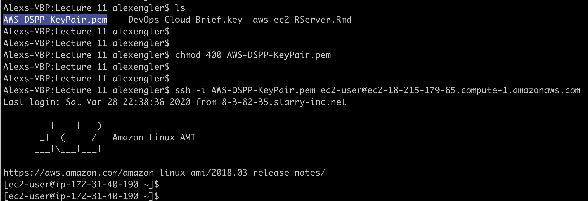
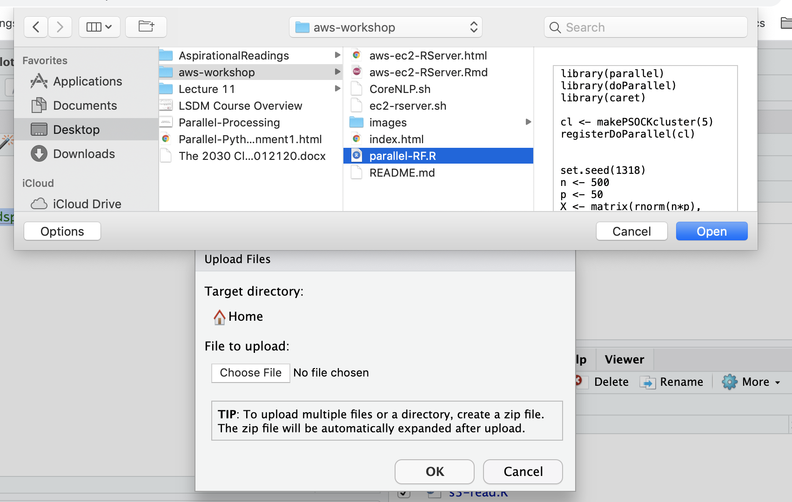
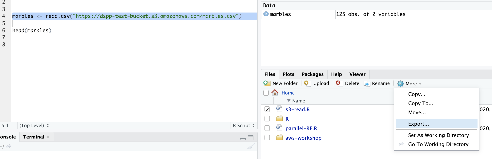

# DSPP Workshop: Introduction to the AWS Cloud

## What We Will Cover

- Overview of the AWS Web Console
- Launching an EC2 (Elastic Cloud Compute) Instance
- The AWS Command Line Interface (CLI)
- Security & Access: SSH, Ports, and Security Groups
- Installations in Linux Environments
- Using RStudio Server in the Cloud

-----

First, open the [AWS Console](https://console.aws.amazon.com/console/). Under 'Find Services', search for 'EC2' and select that service from the dropdown. Then click the orange button towards the bottom of that page that says "Launch Instance."

An 'instance' is a single computer that you are renting. This word is used interchangeably with 'server' and 'machine.' You can think of a instance (or server or machine) as a full-functioning computer, but with no screen, keyboard, or mouse. You cannot walk up to this computer and use it (also, it's in an Amazon data center).

#### Step 1: Choosing a Linux Distribution

You must choose an operating system for the instance you are renting, and cannot change it once the instance is launched. While the AWS AMI (an Amazon-developed distribution of Linux based on RedHat) is best optimized and least-buggy working on AWS machinery, you might sometimes want to use Ubuntu so you have easier access to the [many packages available in the Debian environment](https://www.ubuntu.com/community/debian). This will be the case when we deploy Stanford's CoreNLP.

**We will use 'Amazon Linux AMI 2018.03.0 (HVM), SSD Volume Type'.**

#### Step 2: Choosing an Instance Type.

Each AWS instance has a pre-set combination of hardware, mostly focussed on memory and processors. As a reminder, more memory allows you to analyze bigger datasets . More processors will let you perform computations faster.

Different families of instance types are specialized for different tasks. For example, the C-family of instances is optimized for computation. The R-family of instances is best optimized for memory. AWS document has lots of material [on their instance types](https://aws.amazon.com/ec2/instance-types/) as well as [their pricing](https://aws.amazon.com/ec2/pricing/), which is billed per-second in most cases.

**For now, scroll down and select 't3.small', then click "Nect: Configure Instance Details."**


#### Step 3: Configure Instance Details

This page allows you to set security and advanced features that we need not worry about.

**Click "Next: Add Storage"

#### Step 4: AWS Storage

The default type of storage is 'Instance Store' which is a part of the instance you are renting.The important consideration with instance storage is that, by default, it only lasts as long as your machine. Anything software you install, any core you write, and any data you create disappears when you terminate your instance. 
For our purposes, this is fine, since we will save data to AWS S3 and code to our local computers.

Other types of storage can last beyond the life of a single instance, for example: Elastic Block Storage. There is more detail in the [AWS EC2 Storage Guide](https://docs.aws.amazon.com/AWSEC2/latest/UserGuide/Storage.html), for those who want to learn about the four common storage options available for EC2.

**For our purposes, you can leave the default storage settings alone and click "Next: Adds Tags"**

#### Step 5. Add Tags

Tags allow you to associate instances with a specific code. This is used by organizations to keep track of billing, and thus for now we can ignore it. 

**Nothing to do on this page, click "Next: Configure Security Group."

#### Step 6: Configuring the Security Group

A security group is a set of configuration settings that detail what ports can be accessed over the internet. A port it an access point to a computer (instance/server/machine). By default, all ports are closed and inaccessible, except for port 22 to enable SSH access (more on this shortly).

We want to open three ports:

- 22 for SSH
- 80 for HTTP
- 8787 for RStudio Server

However, we do not want anyone to be able to access this machine. So instead of leaving 'Source' set to 'Anywhere', which means anyone can access the machine, we should set it to "My IP."

Note: your IP changes when you move between wifi networks, or even sometimes when you re-access the same wifi network (as is often the case on university campuses). If it changes, and you do not update a security group, you will no longer be able to access any instances using that security group. You can google 'my ip' to see your current IP address. 

Give the security group a name and description, and click "Review and Launch."

#### Step 7: Review Instance Launch

Review the details you choose and click "Launch", which leads us to one more step.

### AWS Key Pairs

A key-pair is a pair of files we will use with SSH to access the 

**Create a new key pair named 'AWS-DSPP-KeyPair' and click "Download Key Pair"**

**When you see the key-pair has downloaed, click "Launch Instance"**


### Overview of AWS Security So Far:

Amazon Web Services (AWS) has extensive security procedures, and so they can get a bit confusing. So far, we have gone through three security steps - the first is for AWS Console, and the next two were specific to the instance we just launched:

 - For your homework assignment, you configured the AWS CLI using an 'AWS Access Key'. This gives your AWS CLI complete control over the use of AWS account, but **does not grant access to individual instances.**
 - Just now, you created a new instance and assigned it a security group, which enables access only from your IP address to certain ports on that instance.
 - Then, we created a key-pair, which we will use with SSH to access the instance you just created.
 

### AWS Command Line Interface (CLI)

We can use the AWS CLI to see that we have launched an AWS instance. Open Terminal or Command Promp and run `aws ec2 describe-instances` to get a description of the instance we launched. To learn more about the AWS cli, you can use the help command:

`aws help`
`aws ec2 help`
`aws ec2 describe-instances help`

You can search for a specific instance by its id, 

`aws ec2 describe-instances --instance-id instance-id-goes-here`

The `--query` argument allows you to explore the output from AWS CLI commands.

`aws ec2 describe-instances --query 'Reservations[*].Instances[*].[InstanceId,ImageId]'`

Get the Public DNS Name:

`aws ec2 describe-instances --query 'Reservations[*].Instances[*].PublicDnsName'`

You can see more examples of [using describe-instances in the AWS documentation](https://docs.aws.amazon.com/cli/latest/reference/ec2/describe-instances.html).


## Accessing our EC2 Instance

### SSH (Secure Shell) Protocol

SSH is an [implementation of public key cryptography](https://winscp.net/eng/docs/ssh_keys ). The key you have downloaded is the private key, which you should not share with anyone else. The public key is registered to the the EC2 instance (you did this as the last step beore launching) and is used to validate your private key, ensuring you are who you say you are and granting access to the remote server. Together, these keys make up a key-pair.

SHH encrypts data exchanged across an insecure network – allowing you to easily and securely work across multiple computers from one location. While Mac OsX has a native SSH client, Windows users will need to [use Putty](https://www.putty.org/).

Open Terminal or Command Prompt, and navigate to where you put your key-pair.


### SSH'ing into the EC2 Machine (Windows)

This is based off this AWS guidance to [connecting using Putty](https://docs.aws.amazon.com/AWSEC2/latest/UserGuide/putty.html).

#### Step 1: Create .ppk file with PuttyGen

 - Open PuttyGen (which is installed when you install Putty).
 - Type of key to generate, choose RSA
 - Choose 'Load' and change the file type dropdown from 'Putty Private Key-Files (*.ppk)' to 'All files (".")'.
 - Select your AWS-DSPP-KeyPair.pem file - this is the key-pair you downloaded and named AWS-DSPP-KeyPair.pem and click 'Open. Choose 'ok' when prompted.
 - Then click 'Save private key' and you will see a warning, ignore that warning and click 'Yes'.
 - Use the same name (though it has a different file ending): AWS-DSPP-KeyPair.ppk

#### Step 2. Use Putty to SSH into AWS Instance
 
 - Open PuTTY
 - Choose Session from the list of menus on the left and complete the following fields:
    - Host is ec2-user@instance_public_DNS
    - Port value is 22.
    - Under Connection type, select SSH.
 
**Instance-DNS needs to be changed to the actual ID for the instance you launched. You can find that on the [EC2 page](https://console.aws.amazon.com/ec2/v2/home?region=us-east-1#Instances) within the AWS Console.** That might look like this: `ec2-54-152-137-101.compute-1.amazonaws.com`

 - Choose Connection from the list of menus on the left, click the SSH menu under that
  - Choose Browse
  - Select your AWS-DSPP-KeyPair.ppk file and click Open
  - Click Open
  - Choose 'Yes' when prompted if you trust the host

### SSH'ing into the EC2 Machine (Mac)

First, use terminal to navigate to the same directory as your `AWS-DSPP-KeyPair.pem` file. Then change the permissions for your AWS key:

```{bash eval=FALSE}
chmod 400 AWS-DSPP-KeyPair.pem
```

Next, to SSH in from a Mac, you will need to change the below command and run it in terminal.

```{bash eval=FALSE}
ssh -i AWS-DSPP-KeyPair.pem ec2-user@instance_public_DNS -y
```

**instance_public_DNS needs to be changed to the actual ID for the instance you launched. You can find that oi two different ways.**  One option is to run the following line in terminal:

```{bash eval=FALSE}
aws ec2 describe-instances --query 'Reservations[*].Instances[*].PublicDnsName'
```

Alternatively you can see the instance's public DNS on the [EC2 page](https://console.aws.amazon.com/ec2/v2/home?region=us-east-1#Instances) within the AWS Console.** 


That might look like this:

```{bash eval=FALSE}
ssh -i AWS-DSPP-KeyPair.pem ec2-user@ec2-54-152-137-101.compute-1.amazonaws.com -y
```

A successful process will look like the one below:



Notes:

 - AWS-DSPP-KeyPair.pem is the name of the private key you created, and so you must be in the same directory as that file.
 - We use the -i flag to open an interactive shell, just like Terminal, except it will be inside the EC2 instance.
 - `ec2-user` is the default user for this type of AWS instance.
 - the -y flag lets us skip a prompt that asks if we trust the computer we are reaching out to (we do). 

## Installing Software in Your AWS Instance

The AWS Linux AMI is based off of Red Hat, which means it uses Red Hat’s package installation systems. Specifically yum (Yellowdog Update Modifier) and rpm (RedHat Package Manager). We will use yum for now, as it adds package management features on top of rpm (however note yum lets you install .rpm files). You can read more about [basic yum functionality here](https://www.thegeekstuff.com/2011/08/yum-command-examples/?utm_source=feedburner).

```{bash eval=FALSE}
sudo yum update 
sudo yum install -y R
```
We can use `wget`, short for web-get, to download files from the internet. This can be used in conjunction with `yum install`, as you see below while installing RStudio Server.

```{bash eval=FALSE}
wget https://download2.rstudio.org/rstudio-server-rhel-1.1.456-x86_64.rpm 
ls
```

If you look at much open-source software, you will find instructions for installing that software on various Linux distributions. For instance, you can see instructions for installing RStudio Server on [several different Linux distributions on the RStudio website](https://www.rstudio.com/products/rstudio/download-server/).

Now we use yum to install RStudio server.

```{bash eval=FALSE}
sudo yum install rstudio-server-rhel-1.1.456-x86_64.rpm -y
```

And we can now remove the `.rpm` file.

```{bash eval=FALSE}
rm rstudio-server-rhel-1.1.456-x86_64.rpm
```
Next, we can execute some R code from the command line:

```{bash eval=FALSE}
sudo R -e "5 + 25"
sudo R -e "head(mtcars)"
```

We can also add a new user to the machine, which is automatically granted R Studio access (this is a useful feature of R Studio).

```{bash eval=FALSE}
echo ec2-user:test | sudo chpasswd 
```

At this stage, you can use your web browser to actually visit the R Studio GUI, where you could run R code as you would normally, except it will be running on the remote cloud machine. To do this, simply go to the a url composed of the instance's public DNS, a colon, and then the port number (8787).

```{bash eval=FALSE}
instance_public_DNS:8787
```

This might look like:

```{bash eval=FALSE}
ec2-54-152-137-101.compute-1.amazonaws.com:8787/
```

## Bringing in Data and Code

#### 1. AWS CLI

You can use the AWS CLI in your remote machine as well, below copying some R code and data from  one of my S3 buckets. This is only going to work if you grant your remote machine with AWS credentials (i.e. going through the `aws configure` steps).

```{bash eval=FALSE}
aws s3 cp s3://lsdm-util/wapo-police.R ./
aws s3 cp s3://lsdm-util/fatal-police-shootings-data.csv ./wapo-data.csv
```

#### 2. Git

Instead, let's install Git and clone a repository with some R code in it.

```{bash eval=FALSE}
sudo yum install -y git
git clone https://github.com/alexcengler/aws-workshop.git
```

If you now refresh the file, you'll now see the github repo in the file directory for R, allowing you to open the R code that was in the repo.

#### 3. RStudio

If we add data to AWS S3 and **make the bucket public** we can read it directly into R, like below/ Note that the bucket name is `dspp-test-bucket`.

```{R eval=FALSE}
marbles <- read.csv("https://dspp-test-bucket.s3.amazonaws.com/marbles.csv")
```

You can download and upload files directly from RStudio. If you visit `instance_public_DNS:8787` in your web browser, you will note that RStudio Server is slightly different from RStudio. For instance, in the `Files` pane, it has an `Upload` option you can click to copy files from your local computer to the EC2 instance. 



Similarly, you can use the `Export` option under the `More` dropdown to copy new .R files from the RStudio environment to your local computer. It is important to copy and code and data you create on your EC2 instance to another location **because the EC2 instance is temporary and all of its files will be deleted when you terminate the instance**. Common solutions are to copy your code locally, to AWS S3, or to GitHub. Data is most frequently stored in AWS S3.




### Infrastructure as Code

Instead of working through this long process manually, we can use the AWS command line and a bash script to automate the entire process. We use `aws ec2 run-instances` with an image-id (this is the AWS Linux Machine Image), a count (number of instances), the instance type, the private key name, and an id for the security group. 

You will need to do two things for this to work:

 - Change the security-group-ids flag to the code associated with the security group you created. You can see these codes under 'Security Groups' on the 'EC2' page in the AWS console. [This link may work](https://console.aws.amazon.com/ec2/v2/home?region=us-east-1#SecurityGroups:).
 - Make sure you are in the same working directory as your `AWS-DSPP-KeyPair.pem` file and that it is named exactly the same. If it is not named the same, please change the name. 

```{bash eval=FALSE}
aws ec2 run-instances --image-id ami-09a5b0b7edf08843d --count 1 --instance-type t3.small --key-name AWS-DSPP-KeyPair --security-group-ids sg-0258951dfe0eb4a38
```
  
Note that the above code will launch an EC2 instance, but with no software installed. However, we can rewrite our earlier linux bash commands into one script, which I have done below (and also saved in the repository as `ec2-rserver.sh`). You can see that code below - with some notes as to the changes:

(1) I added `#!/bin/bash`, which signals that this file should be run as a bash script. 
(2) Then, I added `set -x –e`, in which `-e` sets an option to exit the bootstrap (which will terminate the instance) if there is any error code. `-x` enables the xtrace option, which is useful for printing to logs and I recommend that you do it as well.
(3) I removed `sudo`, since these user files are run as the root user.
(4) I added `-y` flag to `yum update`, since you cannot run commands that need user response (since this is not an interactive shell).
(5) I specified the path of the git clone to /home/test/aws-workshop, which is the equivalent location for where this repository would have been in my prior manual instance launches (note that `/home` in this case is home of the root user during the installation process, not home of the `ec2-user` we have been ssh'ing into the machine as).

```{bash eval=FALSE}
#!/bin/bash 
set -x –e

yum update -y
yum install -y R

wget https://download2.rstudio.org/rstudio-server-rhel-1.1.456-x86_64.rpm 

yum install rstudio-server-rhel-1.1.456-x86_64.rpm -y

rm rstudio-server-rhel-1.1.456-x86_64.rpm

R -e "install.packages(c('doParallel','foreach'), repos='http://cran.rstudio.com/')"

echo ec2-user:test | chpasswd 

yum install -y git
git clone https://github.com/alexcengler/aws-workshop.git /home/ec2-user/aws-workshop
```

Having done this, we can then add the `--user-data` flag to our `aws ec2 run-instances` command. We will pass out .sh file to the `--user-data` flag, which signals that this code should be run on the EC2 instance after it is launched.

```{bash eval=FALSE}
aws ec2 run-instances --image-id ami-09a5b0b7edf08843d --count 1 --instance-type t3.small --key-name AWS-DSPP-KeyPair --security-group-ids sg-0258951dfe0eb4a38 --user-data file://ec2-rserver.sh
```

And then you should be able to ssh into the machine as normal. Alternatively you can visit the RStudio Server at  `instance_public_DNS:8787` and login with username 'test' and password 'test_pw'. Please note it might take 5 or so minutes for the new instance to go through these installations.

```{bash eval=FALSE}
ssh -i AWS-DSPP-KeyPair.pem ec2-user@DNS
```

