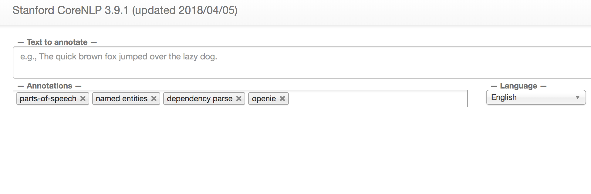
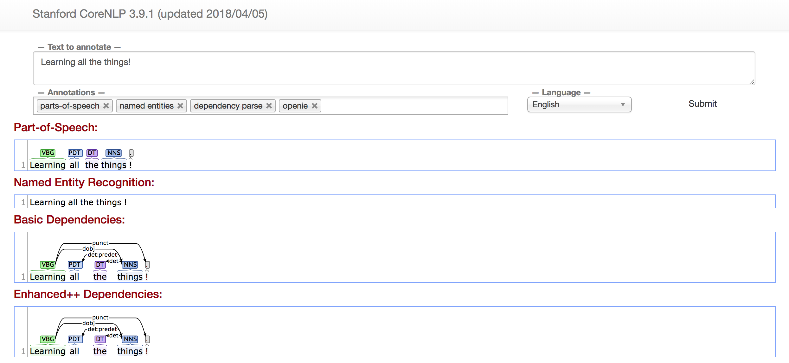

### What We Will Cover

- Overview of the AWS Web Console
- Launching an EC2 (Elastic Cloud Compute) Instance
- SSH, Ports, and Security Groups
- Installations in Linux Environments
- AWS File Storage (S3, EBS, Instance Store, EFS)
- The AWS Command Line Interface (CLI) and Boto3 SDK
- Deploying & Querying a CoreNLP Server 

-----

First, open the AWS Console and navigate to the Elastic Cloud Compute (EC2) page. There, proceed to launch a new instance.

#### Choosing a Linux Distribution

You must choose an operating system for the machine you are renting, and cannot change it once the instance is launched. While the AWS AMI (an Amazon-developed distribution of Linux based on RedHat) is best optimized and least-buggy working on AWS machinery, you might sometimes want to use Ubuntu so you have easier access to the [many packages available in the Debian environment](https://www.ubuntu.com/community/debian). This will be the case when we deploy Stanford's CoreNLP.

For now, select 'Amazon Linux AMI 2018.03.0 (HVM), SSD Volume Type'.

#### Choosing an Instance Type.

An AWS instance is a pre-set combination of hardware, mostly focussed on memory and processors. Different families of instance types are specialized for different tasks. For example, the C-family of instances is optimized for computation. The R-family of instances is best optimized for memory. AWS document has lots of material [on their instance types](https://aws.amazon.com/ec2/instance-types/) as well as [their pricing](https://aws.amazon.com/ec2/pricing/), which is billed per-second in most cases.

For now, select 't3.small'.

#### AWS Storage

There are four common storage options available for EC2, each useful in different circumstances. The [AWS EC2 Storage Guide](https://docs.aws.amazon.com/AWSEC2/latest/UserGuide/Storage.html) is particularly useful in determining what you need.

- Instance Store - virtualized block storage attached (physically) to the instance, but are ephemeral.
- Elastic Block Storage (EBS) - virtualized block storage that can persist beyond the life of the instance.
- AWS Simple Storage System (S3) - universally available object storage. 
- AWS Elastic File System (EFS) - hierarchical file storage that can be mounted onto one or multiples instances.

For this, you can leave the default storage settings as is.

#### Configuring the Security Group

A security group is a set of configuration settings that detail what ports can be accessed over the public internet. You should open ports:

- 22 for SSH
- 80 and 443 for HTTP and HTTPS
- 8787 for RStudio Server
- 3838 for R Shiny


#### AWS Command Line Interface (CLI)

`aws help`

`aws ec2 help`

`aws ec2 describe-instances`

`aws ec2 describe-instances help`

The `--query` argument allows you to explore the output from AWS CLI commands.

  `aws ec2 describe-instances --query 'Reservations[*].Instances[*].[InstanceId,ImageId]'`

Get the Public DNS Name:

`aws ec2 describe-instances --query 'Reservations[*].Instances[*].PublicDnsName'`

Return the Availability Zone, State, Instance Type, KeyName, and Instance Id of all AWS EC2 instances as text, then find those that contain 'running'.

`aws ec2 describe-instances --query 'Reservations[*].Instances[*].[Placement.AvailabilityZone, State.Name, InstanceType, KeyName, InstanceId]' --output text |  grep running`

Or return those of a specific instance type:

`aws ec2 describe-instances --query 'Reservations[*].Instances[*].[Placement.AvailabilityZone, State.Name, InstanceType, KeyName, InstanceId]' --output text |  grep t3`


#### SSH (Secure Shell) Protocol

SSH is an [implementation of public key cryptography](https://winscp.net/eng/docs/ssh_keys ). The key you have downloaded is the private key, which you should not share with anyone else. The public key is registered to the remote server (the EC2 instance) and is used to validate your private key, ensuring you are who you say you are and granting access to the remote server. Together, these keys make up a key-pair.

SHH encrypts data exchanged across an insecure network – allowing you to easily and securely work across multiple computers from one location. While Mac OsX has a native SSH client, Windows users will need to [download Putty](https://www.putty.org/).

You likely need to change the permissions for your AWS key:

```bash
chmod 400 aws-workshop.pem
```

Then SSH into the EC2 Node (the -i flag creates an interactive shell). `ec2-user` is the default user for AWS Amazon Machine Images, whereas an Ubuntu Linux machine will have a default user of `ubuntu` and the default user name of `hadoop` for AMS Elastic MapReduce (EMR). 

```bash
ssh -i keyname.pem ec2-user@instance-DNS
```

This might looks like this:

```bash
ssh -i aws-workshop.pem ec2-user@ec2-3-14-70-93.us-east-2.compute.amazonaws.com
```

Note, the ec2-user is specific to the AWS version of Linux for EC2. Using AWS Elastic MapReduce, you'd need to use the user `hadoop`, and using an Ubuntu version of Linux, you'd need to use `Ubuntu`.


#### Installations in Linux

The AWS Linux AMI is based off of Red Hat, which means it uses Red Hat’s package installation systems. Specifically yum (Yellowdog Update Modifier) and rpm (RedHat Package Manager). We will use yum for now, as it adds package management features on top of rpm (however note yum lets you install .rpm files). You can read more about [basic yum functionality here](https://www.thegeekstuff.com/2011/08/yum-command-examples/?utm_source=feedburner).

```bash
sudo yum update 
sudo yum install -y R
```
We can use `wget`, short for web-get, to download files from the internet. This can be used in conjunction with `yum install`, as you see below while installing RStudio Server.

```bash
wget https://download2.rstudio.org/rstudio-server-rhel-1.1.456-x86_64.rpm 
ls
```

If you look at much open-source software, you will find instructions for installing that software on various Linux distributions. For instance, you can see instructions for installing RStudio Server on [several different Linux distributions on the RStudio website](https://www.rstudio.com/products/rstudio/download-server/).

Now we use yum to install RStudio server.

```bash
sudo yum install rstudio-server-rhel-1.1.456-x86_64.rpm -y
```
And we can now remove the `.rpm` file.

```bash
rm rstudio-server-rhel-1.1.456-x86_64.rpm
```
Next, we can execute some R code from the command line, in this case, installing several pertinent packages:

```bash
sudo R -e "install.packages(c('shiny','doParallel'), repos='http://cran.rstudio.com/')"
```
We can also add a new user to the machine, which is automatically granted R Studio access (this is a useful feature of R Studio).

```bash
sudo useradd ec2-user
echo ec2-user:RisGreat | sudo chpasswd 
```

At this stage, you can use your web browser to actually visit the R Studio GUI, where you could run R code as you would normally, except it will be running on the remote cloud machine. To do this, simply go to the

```bash
DNS:8787
```

This might look like:

```bash
ec2-user@ec2-3-14-70-93.us-east-2.compute.amazonaws.com:8787/
```

#### Bringing in Data and Code

You can use the AWS CLI in your remote machine as well, below copying some R code and data from  one of my S3 buckets. This is only going to work if grant your remote machine with AWS credentials. Given the incredibly open access settings we created for this machine, that is likely to be a very bad idea.

```bash
aws s3 cp s3://lsdm-util/parallel-RF.R ./
aws s3 cp s3://lsdm-util/wapo-police.R ./
aws s3 cp s3://lsdm-util/fatal-police-shootings-data.csv ./wapo-data.csv
```

Instead, let's install Git and clone a repository with some R code in it.

```bash
sudo yum install -y git
git clone https://github.com/alexcengler/aws-workshop.git
```

If you now refresh the file, you'll now see the github repo in the file directory for R, allowing you to open the R code that was in the repo.

#### Infrastructure as Code

Instead of working through this long process manually, we can use the AWS command line and a bash script to automate the entire process. We use `aws ec2 run-instances` with an image-id (this is the AWS Linux Machine Image), a count (number of instances), the instance type, the private key name, and an id for the security group. 

```bash
aws ec2 run-instances --image-id ami-0552e3455b9bc8d50 --count 1 --instance-type t3.small --key-name aws-workshop --security-group-ids sg-0f3fa78cdd06d68f7
```
  
Notably, in this case we have created the security group in advance. You can do this in the EC2 console, under the 'Security Groups' section of the menu on the left of the page. After creating a security group, it will be assigned an ID, which is what you see being passed to the AWS CLI line above. 

Finally, we can rewrite our earlier linux bash command into one script, which I have done below (and also saved in this repository as `ec2-rserver.sh`). You can see that code below, with only a few minor changes. 

(1) I added `#!/bin/bash`, which signals that this file should be run as a bash script. 

(2) Then, I added `set -x –e`, in which `-e` sets an option to exit the bootstrap (which will terminate the instance) if there is any error code. `-x` enables the xtrace option, which is useful for printing to logs and I recommend that you do it as well.

(3) I removed `sudo`, since these user files are run as the root user.

(4) I added `-y` flag to `yum update`, since you cannot run commands that need user response (since this is not an interactive shell).

(5) I specified the path of the git clone to /home/test/aws-workshop, which is the equivalent location for where this repository would have been in my prior manual instance launches (note that `/home` in this case is home of the root user during the installation process, not home of the `ec2-user` we have been ssh'ing into the machine as).

```bash
#!/bin/bash 
set -x –e

yum update -y
yum install -y R

wget https://download2.rstudio.org/rstudio-server-rhel-1.1.456-x86_64.rpm 

yum install rstudio-server-rhel-1.1.456-x86_64.rpm -y

rm rstudio-server-rhel-1.1.456-x86_64.rpm

R -e "install.packages(c('shiny','doParallel','caret'), repos='http://cran.rstudio.com/')"

useradd test
echo test:test_pw | chpasswd 

yum install -y git
git clone https://github.com/alexcengler/aws-workshop.git /home/test/aws-workshop
```

Having done this and saved the file as `ec2-rserver.sh`, we can use `aws ec2 run-instances` to run through the entire process of automating our cloud machine launch.

```bash
aws ec2 run-instances --image-id ami-0b59bfac6be064b78 --count 1 --instance-type t3.small --key-name aws-workshop --security-group-ids sg-0f3fa78cdd06d68f7 --user-data file://ec2-rserver.sh
```
And then you should be able to ssh into the machine as normal. Alternatively you can visit the RStudio Server at  `DNS:8787` and login with username 'test' and password 'test_pw'. Please note it might take 4-6 minutes to go through these installations.

```bash
ssh -i "aws-workshop.pem" ec2-user@DNS
```

### Stanford CoreNLP

Included below are thorough instructions on how to install CoreNLP on an AWS EC2 instance, with only minimal requirements of the student (constructing the AWS CLI command, security group, choosing an EC2 instance, etc). Before starting, you should take a minute to [read about the basics of CoreNLP](https://stanfordnlp.github.io/CoreNLP/).

Please note this launches an EC2 instance running the Ubuntu AMI (a different AMI than we used in class), which you either specify at the command line or choose on the first page of options when you launch an EC2 instance from the AWS console. The AMI ID for the Ubuntu Server 18.04 LTS (HVM) is `ami-0782e9ee97725263d`. Further note that if you decide to SSH into this machine, you need to point SSH to `ubuntu@dns` to do so (rather than `ec2-user@dns` like we did in class), though you do not need to SSH into the machine to complete this assignment.

### CoreNLP Server Setup Instructions

Follow the ensuing instructions in order to setup an elastic CoreNLP Server.

First, create a file called `CoreNLP.sh` the includes the following bash script. You will need to pass this into your AWS CLI command to launch the CoreNLP Server.

```bash
#!/bin/bash 
set -x –e

apt-get update -y
apt-get install -y default-jre

wget http://nlp.stanford.edu/software/stanford-corenlp-full-2018-10-05.zip

apt install unzip
unzip stanford-corenlp-full-2018-10-05.zip

cd stanford-corenlp-full-2018-10-05

for file in `find . -name "*.jar"`; do export
CLASSPATH="$CLASSPATH:`realpath $file`"; done 

java -mx4g -cp "*" edu.stanford.nlp.pipeline.StanfordCoreNLPServer -port 9000
```

Stanford's CoreNLP uses a lot of memory, so choose an instance with at least 8GB of memory.

Create a new security group for your CoreNLP server, at the very least opening up a port for ssh (though you may not need to do that) and the port for CoreNLP Server.

Write an AWS CLI command to launch an EC2 instance that:
- Runs the `CoreNLP.sh`, making sure use the following syntax precisely: `file://CoreNLP.sh` (the `file://` is unusual but required exactly as is).
- Assigns the CoreNLP Security Group - please note you must use the security group ID, which starts with `sg-` following by a long unique identifier. This is different than the name you give the security group.
- Uses the Ubuntu Server 18.04 LTS (HVM), SSD Volume Type, which uses `ami-0f65671a86f061fcd` 
- Employs a keypair for secure access

#### Testing the Server

If you visit the url `DNS:9000` you should see a screen that looks like this:



If you manually enter a sentence, you will see a result that looks like the image below. Note the first request you send towards it will cause it to wait a bit (as it installs further dependencies in response to your requests). Just give it a few minutes.




#### Testing the API

At this stage, you should now be able to send API calls to the CoreNLP server and receive results. There is a brief example in R below.

```{R}
library(xml2)
library(XML)
library(httr)

url <- "http://ec2-3-14-7-41.us-east-2.compute.amazonaws.com:9000/"

## Define the annotators, meaning what CoreNLP functions to run on the text.
query_properties <- '{"annotators": "tokenize,ssplit,lemma,pos,ner,depparse,openie,sentiment"}'
test <- "I can analyze all the documents! I am a god!"

r <- POST(url, query = list(properties = query_properties), body =  test, encode = "form")
attributes(r)

r$url ## See the URL constructed by the POST request
r$status_code ## See the returned status code (200 is good)

r_cont <- content(r)
class(r_cont)

length(r_cont$sentences)
print(r_cont$sentences[[2]]$sentiment)
```

CoreNLP's Annotators are functions that operate CoreNLP's main functionality. Above, the query is calling the annotators for tokenization, sentence split, lemmatization, parts-of-speech tagging, named entity recognition, dependency parsing, open information exraction, and sentiment analysis. There are more, which you can see in [this CoreNLP Introduction](http://www.sfs.uni-tuebingen.de/~keberle/NLPTools/presentations/CoreNLP/CoreNLP_introduction.pdf).


### AWS CLI Command for CoreNLP Server

The answer to the prompt above:

```bash
aws ec2 run-instances --image-id ami-0f65671a86f061fcd --count 1 --instance-type t2.xlarge --key-name aws-workshop --security-group-ids sg-05a485114a1038823 --user-data file://CoreNLP.sh 
```